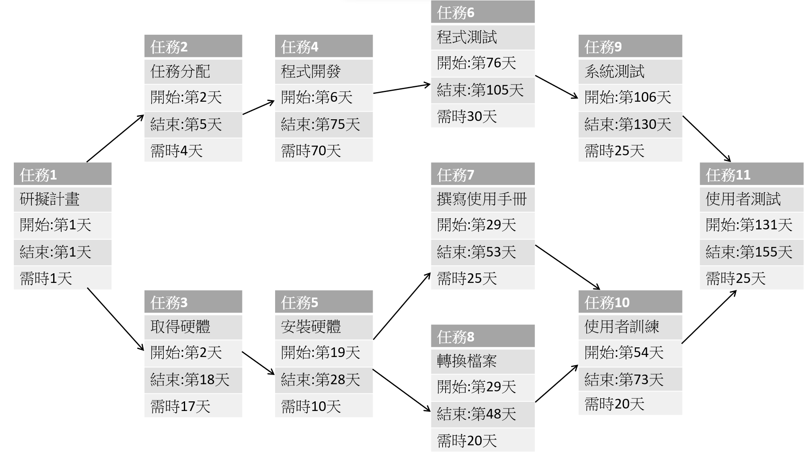

# Group_12 第12組
## 專題名稱:人工口罩辨識系統

## 小組成員:
#### *C110118221 陳俊儒*
#### C110118240 張凱宸
#### C110118244 陳力銓
#### C110118227 黃逸堃
# 甘特圖

```mermaid
gantt
    title A Gantt Diagram

    section 任務1
    專案設想       : a1 , 2014-01-01 , 1d
    section 任務2
    任務分配       : a2 , after a1 , 4d
    section 任務3
    資料蒐集       : a3 , after a1 , 17d
    section 任務4
    資料整合      : a4 , after a2 , 70d
    section 任務5
    程式開發      : a5 , after a2 ,10d
    section 任務6
    程式測試       : a6 , after a4 , 30d
    section 任務7
    程式修改   : a7 , after a5,25d
    section 任務8
    轉換檔案       :a8 , after a5 , 20d
    section 任務9
    系統測試       : a9 , after a6 , 25d
    section 任務10
    使用者訓練     : a10 , after a7,20d
    section 任務11
    使用者測試     : a11 , after a9 , 25d
```

# pert 圖

# 關鍵路徑
1 -> 2 -> 4 -> 6 -> 9 -> 11
