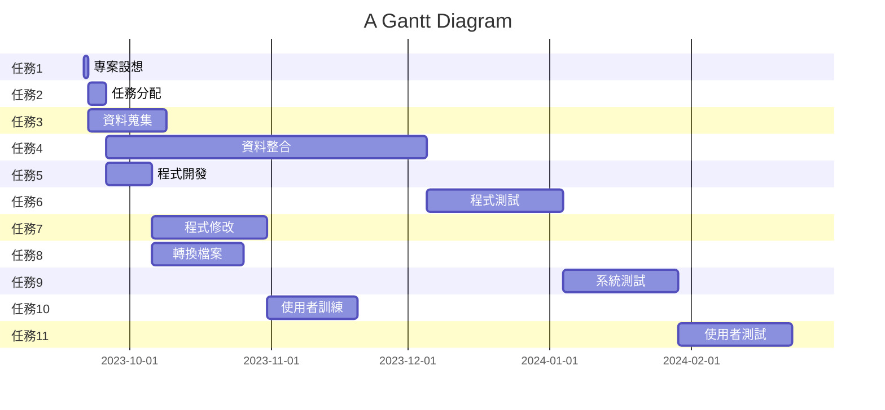

# Group_12 第12組
## 專題名稱:人工口罩辨識系統

## 小組成員:
#### *C110118221 陳俊儒*
#### C110118240 張凱宸
#### C110118244 陳力銓
#### C110118227 黃逸堃
## 專題簡介:
在這個人工智慧的技術已發展趨近成熟的現代,人工智慧的應用可說是相當的廣泛。如果我們可以利用鏡頭搭配人工智慧,讓電腦處裡動態影像,並分辨出人群裡有誰沒戴口罩,再結合門禁系統,讓沒戴口罩的人無法進入室內公共場所。不但可以做中學,如果成本又低的話,利人利己何樂而不為。
# 甘特圖

# pert 圖

# 關鍵路徑
1 -> 2 -> 4 -> 6 -> 9 -> 11
